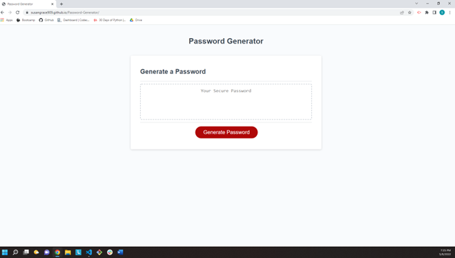

# Password-Generator

- As an employee with access to sensitive data, I want to randomly generate a password that meets certain criteria so that I can create a strong password that provides greater security.

## Description

- This password generator creates a random password . User can choose to include uppercase letters, lowercase letters, numbers, and special characters.

## Acceptance Criteria

- When I click the button to generate a password, I am presented with a series of prompts for password criteria.
- When prompted for password criteria, I select which criteria to include in the password.
- When prompted for the length of the password, I choose a length of at least 8 characters and no more than 128 characters.
- When asked for character types to include in the password, I confrim whether or not to include lowercase, uppercase, numeric, and/or special characters.
- When I answer each prompt, my input should be validated and at least one character type should be selected.
- When all prompts are answered, then a password is generated that matches the selected criteria.
- When the password is generated, the password is either displayed in an alert or written to the page.

## Repository Link

- Repository can be found at:
  [GitHub](https://github.com/susangrace909/Password-Generator.git)
  [Live Site](https://susangrace909.github.io/Password-Generator/)

## Screenshot:

